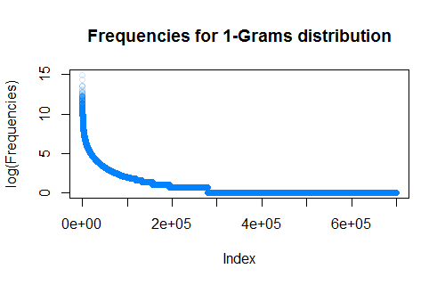
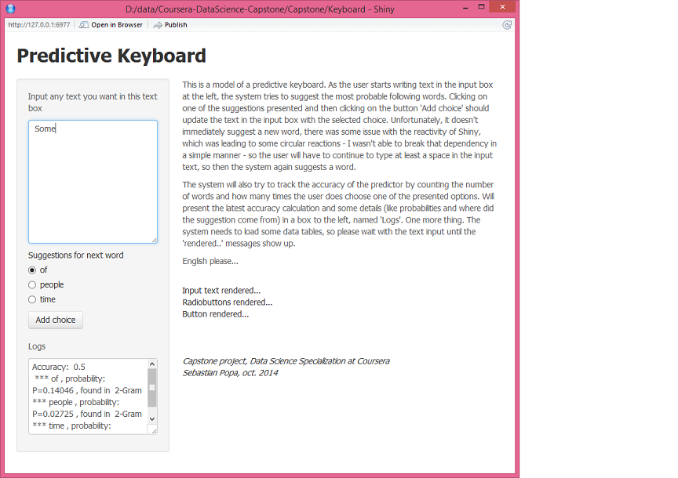

Modeling the Predictive Keyboard
--------------------------------


[Capstone dataset](https://d396qusza40orc.cloudfront.net/dsscapstone/dataset/Coursera-SwiftKey.zip)
```{r}
getwd()
system('wget -nv https://d396qusza40orc.cloudfront.net/dsscapstone/dataset/Coursera-SwiftKey.zip')
system('unzip Coursera-SwiftKey.zip')
system('mv ./final/en_US en_US/')
system('rm -rf ./final')
system('split ./en_US/en_US.twitter.txt --bytes=1M -d --numeric-suffixes --suffix-length=3 --additional-suffix="en_US.twitter.txt"')

system('split ./en_US/en_US.news.txt --bytes=1M -d --numeric-suffixes --suffix-length=3 --additional-suffix="en_US.news.txt"')

system('split ./en_US/en_US.blogs.txt --bytes=1M -d --numeric-suffixes --suffix-length=3 --additional-suffix="en_US.blogs.txt"')

system('mkdir en_US/Split/')
system('mv x* en_US/Split/')
```


```{r}
n  <-  length(list.files(path="./en_US/Split"))
n
```


```{r}
length(sample(1:n))
sample(1:n, prob=3/4)
?sample
```


```{r}
install.packages("rJava")
install.packages("RWeka")
```


```{r cache=TRUE, eval=FALSE}
#library(stringi)
library(RWeka)

## Java stuff
#Sys.setenv(JAVA_HOME="") ## ugly error without this
options(java.parameters="-Xmx14g")  ## give Weka as much memory as possible

## function will parse a file and will write clean lines of that file in other file. 
## e.g. A call like cleanFile("meh.txt", "clean") will create the folder "clean" and inside
## a files - clean_meh.txt etc. This should not contain profanities (as defined above). 

## NOTE - please careful with the param, the function doesn't check them at all. 
cleanFile <- function(fileInput, folderOutput) {
  if (!file.exists(folderOutput)){
    ## create the folder if it doesn't exist
    dir.create(folderOutput)
  }
  ## get the lines from the file. 
  input <- file(fileInput, "rb", encoding = "UTF-8")
  lines <- readLines(input, skipNul = TRUE, encoding = "UTF-8")
  close(input)
  ## open a file for writing
  output <- file(paste(folderOutput, "/clean_", fileInput, sep=""), "w", encoding = "UTF-8")
  for (line in lines){
    line <- iconv(line, to = "UTF-8")
    ## readlines, clean them, write them in the new file. 
    cleanLine <- removeProfanities(line)
    writeLines(text = cleanLine, con = output)
  }
  close(output)
}

## list of profanities, reduced here for readability. The actual list used is much longer. 
## the list in the actual code does contain the actual profanities, shortened here. 
profanities <- c("acroto...", "an..", "ana...", "ars...") ## etc  
                 
## function, will remove profanities from a line and will return the line with no punctuation, 
removeProfanities <- function(line) {
  tokens <- AlphabeticTokenizer(line)
  newline <- ""
  for (token in unlist(tokens))
    if (token %in% profanities) newline <- paste(newline, "(...)")
    else newline <- paste(newline, stri_trans_tolower(token), sep=" ")
  return(newline)
}
```


After running the code above on ALL files, I get in the folder 2_clean, the cleaned version of the initial files. 
I used the Unix split command (*split -l* ) to break the files into 10 chunks each, approximately equal sizes (based on the number of lines of each file - Unix *wc -l* command). I picked at random 1 file for cross training, 2 for testing, 7 for training, for each of the tweets/blogs/news. Moved them into different folders (2_train for training set, 2_test for testing set). 
Now the data is ready for analysis. 


###Create simple models 


At this point I want to create the N-Grams (1 to 5). I'll save the results in a different folder, where I'll start building the model. Using tm and RWeka, the code will look like (do this for all of the 1 to 5-Grams): 

```{r}
## Java stuff
Sys.setenv(JAVA_HOME="")
options(java.parameters="-Xmx14g")
```
```{r cache=TRUE, eval=FALSE}
## create a tokenizer in RWeka, for this example do only the 5-Grams
tokenizer <- function(x) NGramTokenizer(x, Weka_control(min = 5, max = 5))
## load a corpus from a folder
en_texts <- VCorpus(DirSource(directory="data/en_US/2_train", encoding="UTF-8"), 
                    readerControl=list(language="en"))
## options(mc.cores=1)
## create a term document matrix, with the frequencies
tdm <- TermDocumentMatrix(en_texts, control=list(tokenizer=tokenizer))

## process the TDM
tdmMatrix <- as.matrix(tdm)

## get the sums over rows, sort the grams decreasingly by frequency
tf1grams <- rowSums(tdmMatrix)
tf1sorted <- sort(tf1grams, decreasing = TRUE)

## save the vector, has as element names the N-grams (.tf stands for term frequencies)
save(tf1grams, file="3_model/5Grams.tf")
save(tf1sorted, file="3_model/5Sorted.tf")
```

**Note**: loading in parallel on RWeka/MacOS TermDocumentMatrix crashes with some obscure errors. Suggestion to use option mc.cores=1.  
**Note**: working on a "bigger" TermDocumentMatrix crashes the JVM behind RWeka, OutOfMemory. Suggestion to use option java.parameters="-Xmx14g" (heap size up to 14G)  
**Note**: rJava library has problems if the environment variable JAVA_HOME is set. So unset it before loading rJava or RWeka (Sys.setenv(JAVA_HOME=""))  

Some stats with regards to time required to analyze the whole corpus (English): 

N-grams |    User / System  / Elapsed  
------- | ---------------------------  
1-Gram  |  773.86  /  1.77  /   775.69   
2-Gram  |  916.21  /  5.79  /   902.12  
3-Gram  | 2179.20  /  8.42  /  2153.49   
4-Gram  | 2999.19  /  8.60  /  2969.92  
5-Gram  | 3285.18  /  8.86  /  3258.52  


With the sorted term/frequencies, I can look at some basic statistics for the N-Grams.   

1. 1-Grams:  
    * Total different: ~443,000
    * Highest frequency: ~3.3 millions
    * Number of 1's (frequency == 1): ~229,000
    * 6 Most used: *the*, *to*, *and*, *a*, *i*, *of*, *in*, *it*, *that*
2. 2-Grams:
    * Total different: ~10 millions
    * Highest frequency: ~300,000
    * Number of 1's (frequency == 1): ~7.1 millions
    * 6 Most used: *of the*, *in the*, *it's*, *i'm*, *to the*, *for the*
3. 3-Grams:
    * Total different: ~32.7 millions
    * Highest frequency: ~40,000
    * Number of 1's (frequency == 1): ~27 millions
    * 6 Most used:  *i don't*, *one of the*, *a lot of*, *it's a*, *i can't*, *thanks for the*
4. 4-Grams:
    * Total different: ~50 millions
    * Highest frequency: 7898
    * Number of 1's (frequency == 1): ~45.7 millions
    * 6 Most used: *i don't know*, *i'm going to*, *can't wait to*, *the end of the*, *I don't think*, *don't want to*
5. 5-Grams:
    * Total different: ~55.7 millions
    * Highest frequency: 2630
    * Number of 1's (frequency == 1): 53.7 millions (most of them are encountered only once)
    * 6 Most used: *at the end of the*, *i don't want to*, *can't wait to see*, *it's going to be*, *i can't wait to*, *don't know that*

As for a plot, I'll put just the 1-Grams plot (logarithm so I can see the "elbow"). The plots for the rest of the N-Grams will look VERY SIMILAR (except they have lower and lower starting frequencies, and longer and longer tails to the right - meaning more and more Grams with very low counts). 



With above data, one could draw the conclusion that starting with a frequency sorted dictionary with the 1-Grams collected, the quantiles for 0.5, 0.9 and 0.99 (See the *calculateQuantile* function underneath) are: **107 (high frequency) words to cover 50% of the word instances (in this case ~400,000), 6363 words to cover 90%, and 75607 to cover 99% of the word instances.**   

```{r cache=TRUE, eval=FALSE}
## calculate quantiles, quick and dirty method. I have already a probability distribution, 
## in a vector, sorted decreasingly by probability. Loop through the elements, stop when
## the desired quantile is achieved. 
calculateQuantile <- function(distribution, quantile) {## careful, no param checking here. 
  prob <- 0
  for (i in 1:length(distribution)) {
    prob <- prob + distribution[i]
    if (prob > quantile){
      print(prob)
      return(i)
}}}
```


At this point I have all of the 1- to 5-Grams constructed, saved separately as files in the folder 3_model. Some are >6GB when loaded in R, so playing with them becomes quickly a problem. I might need to filter all of the N-Grams, so they contain only the Grams with frequencies > 1 (exception the 1-Grams, I'll use those as dictionary).   

In order to build the N-gram, I'll process the N-grams by breaking them in several different indexes. Each of the N-grams will be saved as intermediary files, as follows:  

  * a file for the "n-gram" to "index" mapping (since the words take most of the memory space, I'll keep them in only one place)
  * a file for the "n-1 gram", the prior. This has the indexes in the N-1 "n-gram to index" mapping (calculated in a prev step)
  * a file for the "1-gram" posterior. This has the indexes in the 1-gram "n-gram to index" mapping (calculated in first step)
  * a file with the calculated probabilities, mapping N-gram to calculated probabilities (sorted decreasingly by probability).
  * PUT ALL OF THEM IN A DATA.TABLE (gives us keys and faster searches)

So, the code underneath does:  

  * load the "term frequency" file, sorted decreasingly in a previous step by frequency
  * extract the "N-gram to index" vector, save
  * extract the priors (N-1-Grams), posteriors (1-Grams), save
  * calculate the conditional probabilities for the N-Grams | N-1-Grams, using MLE
    + P(wn|w1w2..wn-1) = C(w1w2...wn) / C(w1w2..wn-1)
  * with all above, create a data.table, work on the data.table from here on (easy to order, etc)


```{r cache=TRUE, eval=FALSE}
library(data.table)

##..... code removed, left only the 5-Grams. 

## load the 5-grams
load("3_grams/5Sorted.tf")  ## loads the sorted N-Gram to counts map
len5 <-length(tf5Sorted)
indexes5Gram <- 1:len5
names(indexes5Gram) <- names(tf5Sorted)
save(indexes5Gram, file="5_models/indexes5Gram.tf") ## MAPPING N-GRAM TO INDEX

## find prior, posterior
allNames5 <- names(tf5Sorted)
freq5Gram <- unname(tf5Sorted)
save(freq5Gram, file="5_models/freq5Gram.tf")       ## MAPPING INDEX TO COUNTS
allNamesCollapsed5 <- paste(allNames5, collapse = " ")
allNamesVector5 <- unlist(strsplit(allNamesCollapsed5, split = " "))
prior5_1 <- allNamesVector5[seq.int(1, len5 * 5, 5)]
prior5_2 <- allNamesVector5[seq.int(2, len5 * 5, 5)]
prior5_3 <- allNamesVector5[seq.int(3, len5 * 5, 5)]
prior5_4 <- allNamesVector5[seq.int(4, len5 * 5, 5)]
post5 <- allNamesVector5[seq.int(5, len5 * 5, 5)]
prior5 <- paste(prior5_1, prior5_2, prior5_3, prior5_4, sep = " ")
prior5Ix <- indexes4Gram[prior5]
post5Ix <- indexes1Gram[post5]
save(prior5Ix, file="5_models/prior5Gram.tf")     ## MAPPING INDEX TO PRIOR
save(post5Ix, file="5_models/posterior5Gram.tf")  ## MAPPING INDEX TO POSTERIOR

## calculate probabilities for these, use the N-1 probability
prob5Gram <- vector(mode = "integer", length = length(freq5Gram))
for(i in 1:length(indexes5Gram)) 
  prob5Gram[i] <- (freq5Gram[i] / freq4Gram[prior5Ix[i]])
names(prob5Gram) <- names(indexes5Gram)
save(prob5Gram, file="5_models/prob5GramSimple.tf") ## MAPPING N-GRAM TO PROBABILITY

## put all together in a data.table
dt5Grams <- data.table(grams = names(indexes5Gram), 
                       index = indexes5Gram, 
                       frequency = freq5Gram, 
                       prior = prior5Ix, 
                       posterior = post5Ix, 
                       probabilities = prob5Gram)
## most of the searches and operations will be done on priors
save(dt5Grams, file="5_models/dt5Gram.dt")

## sort by prior (increasing) and probability (decreasing)
dt5SortedPriorProb <- dt5Gram[order(prior, -probabilities)]
save(dt5SortedPriorProb, file="5_models/dt5SortedPriorProb.dt")
```

To repeat, at this point I have structures (data.tables) which represent N-grams with:    

  * indexes
  * frequencies
  * priors
  * posteriors
  * probabilities
  
With the above, I can create a new structure for each N-Grams, which is a mapping "prior to best choices for posterior". I'll use the data.tables obtained above.  

```{r cache=TRUE, eval=FALSE}
## keep only 3 posterior choices for each prior, the ones with the higher probability
dt5Priors <- dt5SortedPriorProb$prior
dt5Keep <- cmpMarkFirstN(dt5Priors, 3)               ## <- cmpMarkFirstN is a compiled function
dt5SortedPriorProb$keep <- dt5Keep                   ## <- add the keep vector as a column
dt5SortedFirst3 <- dt5SortedPriorProb[keep == TRUE]  ## <- filter based on keep
dt5GramFinal <- dt5SortedFirst3                      ## <- this is the structure I'll use for the matching
save(dt5GramFinal, file="4_models/dt5GramFinal.dt")  ## <- save in a file
```

This structure has only the 3 best choices for *following word*, for each prior, in each N-Gram set. So it's a small set. I'll use these to start the basic N-Gram tests. 

**Some tests with the N-gram models.**
For these tests, I'll use 2 *accuracy measurements*:

  * First, *estimate next word*. Loop through the test corpus, for each word use the model to estimate next word. Use the model to return ONLY the highest probability one. Compare the model given answer with the actual word. Count the hits/misses, get accuracy. 
  * Second, *estimate next possible 3 words*. This is different, in the way that a software keyboard could give the user several options in regards to the next possible word. In my case, I'll use 3 options. With this in mind, the process will be: parse the testing corpus, and for each word use the model to return 3 possibilities. If the actual next word is in those 3, consider it a "hit". Count hits and misses, calculate accuracy.  
  
Not going to use perplexity measurements. While in general, would give a somewhat accurate measure of "how probable is a certain sentence" (using 5-Grams in this model), would not measure IF the keyboard would be actually useful. Our interest here is to give the user "good options", not necessarily a "high probability of sentence". It's very possible that a model with a lower perplexity would give NO useful predictions to the user. Otherwise, should be trivial to calculate following the steps:  

  * loop through the test text.
  * for each word calculate the probability of that word in the context (5-Grams if I have 4 previous words, etc).
  * log the probability, add it and then calculate the mean - this would be the perplexity.

So, with the accuracy measurements described above, I can go on and run a test against EACH of the N-Grams (these are just basic tests). The code is similar to the following: 

```{r cache=TRUE, eval=FALSE}
## Run the 2-Gram Model. Parameters: 
## data - vector of words to be tested with
## n - number of possibilities to check
## models - the data.tables with the 2-Grams (prior and posterior, 
## 3 options for each prior), and the dictionary 
run2GramModel <- function(data, n, model2, model1) {

  ## if interested in only 1 possibility, filter the model2
  if (n == 1) model2 <- model2[!duplicated(model2$prior),]
  
  ## index model1 by grams
  setkey(model2, grams)
  setkey(model1, grams)
  ## to return: 
  hits <- 0
  misses <- 0
  notin <- 0
  ## loop through the test data
  for(i in 1:(length(data)-1)) {
    ## get the current and next words
    currentWord <- data[i]
    nextWord <- data[i+1]
    ## create a bigram
    g2Gram <- paste(currentWord, nextWord)
    ## check if we have it in our 2-Gram model
    dt <- model2[grams == g2Gram]
    ## interpret
    if (length(dt$index) > 0)
      hits <- hits + 1
    else { 
      ## why wasn't found? Prior, or posterior, not in the models?
      ## find the prior
      mdt <- model1[grams == currentWord]
      if (length(mdt$index) == 0) notin <- notin + 1
      else misses <- misses + 1
    }
  }
  return(c("hits" = hits, "misses" = misses, "notin" = notin))
}
```

I arrive to the following results on the test text (**not involved** in training - about 350,000 words ~ 2MB, taken from a random piece of blogs data):  
NOTE: these tests are done with a *strictly* N-gram model, not with a combination of models.  

    Type of test | Accuracy    
-----------------|----------------------------------------------------------------------------------
1-Gram 1  choice | 5.5%     (basically this model just counts the "the" words in the test vector)    
1-Gram 3 choices | 8%       (this time counts "the", "to", "and")    
2-Gram 1  choice | 15.5%     
2-Gram 3 choices | 23%      (~1200 priors not in model)    
3-Gram 1  choice | 8%       (going down from 2-Grams, ~250000 priors not in model)        
3-Gram 3 choices | 24%      (going up from -Grams, ~200000 priors not in model)       
4-Gram 1  choice | 8%       (same as with only 3)  
4-Gram 3 choices | 16%      (worse than with only 3)    
5-Gram 1  choice | 2.5%     (a lot worse)  
5-Gram 3 choices | 4%       (a lot worse)   

Obviously, the accuracy is expected to start going down further (for higher N-Grams, the probability of getting an unknown word will go up with the N).

### Improve on the model

At this point it becomes obvious that the basic N-Gram model is not enough, we miss enough of the common groups. So a better model is a backoff model, very simple one, a *trivial* back-off. Check for 5-Grams, if found count as hit, if not, check for 4-Grams (4 last words *typed*), etc. If not found anywhere, is a miss (is a little more complicated than this, but not a lot more). Ran on the same test file, the results are obviously better.  

             Type of test | Accuracy    
--------------------------|--------------------------------------------------------------------------------
Trivial backoff 1  choice | 26% (not bad for a 1 choice model), ~800 not in dictionary    
Trivial backoff 3  choice | 37% (for some reason I expected better)    

Now, a big issue is the size of the model: 400,000 1-Grams, 750,000 2-Grams, 14 million 3-Grams, 40 million 4-Grams, over 50 million 5-Grams (this was artificially truncated). This size is already into 16GB RAM, which puts stress on the machine. Growing the model even larger would force the machine to swap, which would make the processing significantly longer.    
I'll try to reduce the size, by trimming the N-grams. I'll use a strategy of removing the 1 time found 1-Grams (misspellings, ad-hoc words or foreing languages), then going through the 2- to 5-Grams and eliminating the ones which correspond to N-1-Grams eliminated earlier (go through the 2-Grams and eliminate the ones with the prior or posterior in the eliminated 1-Grams, then go through the 3-Grams and eliminate.. etc).      
With the trimmed data, I get the reduction in sizes: 

  N-Gram  | Size of data    
----------|--------------------------------------------------------------------------------
  1-Grams | ~200,000 (instead of 400,000)    
  2-Grams | ~225,000 (instead of 10 million)    
  3-Grams | ~2 million (instead of 15 million)    
  4-Grams | ~2.5 million (instead of 40 million)    
  5-Grams | <2 million (instead of 10 million)    

...and the accuracies measurements. 

             Type of test | Accuracy    
--------------------------|--------------------------------------------------------------------------------
Trivial backoff 1  choice | 24.5% (slightly worse than above)    
Trivial backoff 3  choice | 35% (slightly worse as well)   

So the drastic reduction in dimension resulted in a small reduction in accuracy. 

One could calculate a confidence interval for the proportions I obtained (binomial distribution for a sample). Taking for example the last result, 35% for a 300,000 words corpus (take the small text I tested with, not the large one), I get the following: 

    * P = 0.35
    * N = 300,000
    * the confidence interval is P_estimated +/- z * sqrt(P_estimated * (1 - P_estimated) / N)
    * this gets me, for a 95% confidence level (z = 1.96), to the **confidence interval = (34.8%, 35.1%)**

### Data Product

With some methods which use the reduced model above, I created a Shiny app - https://spopa74.shinyapps.io/PredictiveKeyboard/
The app simulates an input into some mobile application. The application will let the user input text, and will suggest possible next words to the words put in. The user can click on the respective suggestions, and a measure of accuracy (how many times clicked vs. total number of words in text) will be measured. Include an image..   




### What can be improved upon? 
There are many ways in which this model can be improved. Probably the best one would be letting the application LEARN from the user. For this, a separate set of N-Grams could be kept and analyzed, the model could be tested against the actual user input (learn for a couple of days, test for a couple more) and it could be compared with the generic model. An interpolation model between the two could be imagined. 


References
-----------

* [1] Natural Language Processing - Dan Jurafsky, Christopher Manning - https://class.coursera.org/nlp/lecture
* [2] Mining the Web, discovering knowledge from hypertext data - Soumen Chakrabarti
* [3] Wikipedia
* [4] Stemming algorithms, stopwords and resources at http://snowball.tartarus.org
